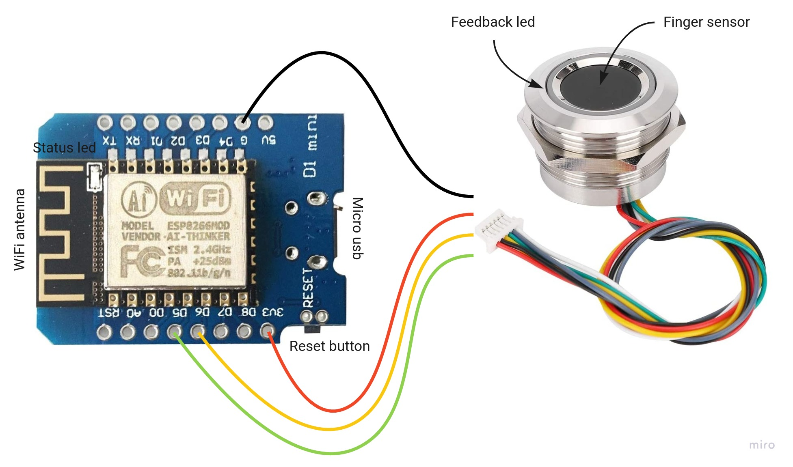
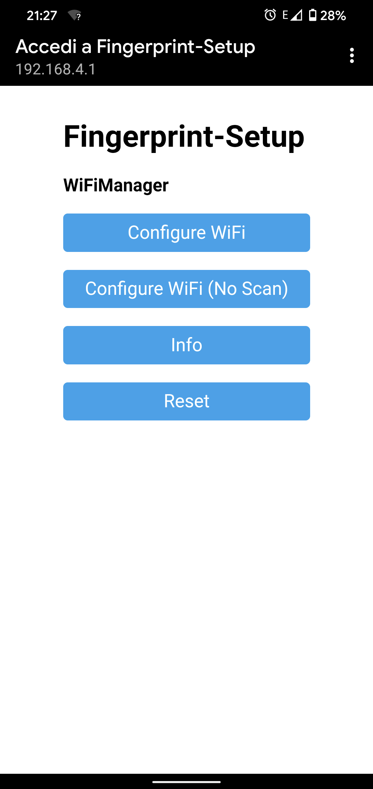
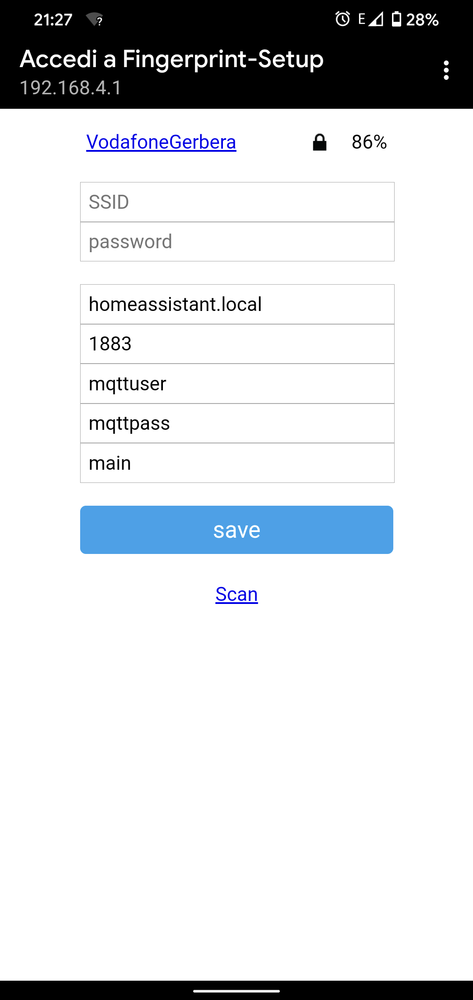
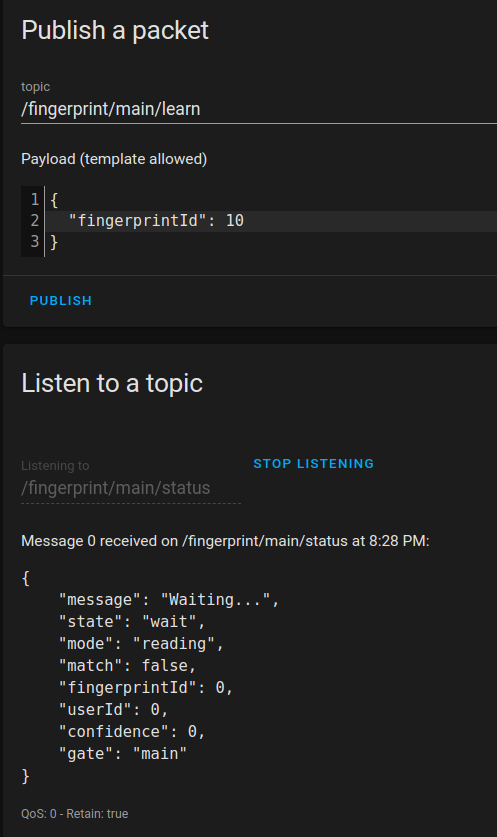

# Fingerprint - R503

## What is this?

This is a firmware for arduino-like devices with integrated WIFI adapter, based on ESP8266 board, like the [Wemos D1 Mini](https://amzn.to/3fP5Pir).

Connect one of these boards to a [R503 Fingerprint capacitive sensor](https://amzn.to/31WWdd6) and you can send commands via MQTT protocol to an IoT hub.

This project is made with [Home Assistant](https://www.home-assistant.io/) integration in mind, but it can be used to only interact with any MQTT broker (see below for some HA integration examples).

## Features
* Simple configuration via WIFI
* Detect different users and different user's fingerprints
* Detect fingerprint mismatch
* Add and delete fingerprints via MQTT
* Led color code feedback

Home Assistant can use messages to enable automations and trigger things like:

* Open a door using electric locks
* Enable/disable alarm system using different fingerprints
* Enable/disable access based on user and/or time
* Activate notifications on unknown fingerprint

## What do you need?

### Hardware

1. [Home Assistant](https://www.home-assistant.io/) with MQTT broker running (or another MQTT broker running on your LAN)
2. A fingerprint sensor model [R503](https://amzn.to/31WWdd6)
3. An ESP8266 board like the [Wemos D1 mini](https://amzn.to/3fP5Pir)

### Software

Interaction will be done sending/receiving MQTT messages to a broker. Most used broker is called [Mosquitto](https://mosquitto.org/) and can be installed as [Home Assistant integration](https://www.home-assistant.io/integrations/mqtt/).

## How to

### Connections


* Red cable on 3.3 volt
* Black cable on ground
* Green cable on pin D5
* Yellow cable on pin D6

The other 2 sensor cables can be left unused.

### Flash

This project is not made using standard Arduino IDE. It's a [PlatformIO](https://platformio.org/) project.

Connect the Wemos to a usb port and:

* Linux (and maybe Mac): type `$ ./install_into_usb_connected_wemos_d1.sh` (python3 and curl are needed)
* Windows: I don't know. Follow [PlatformIO docs](https://docs.platformio.org/en/latest/core/installation.html) to flash under Windows machines.

### Configure

After flash and reboot, when no configuration is found the Wemos will turn on a WiFi network called "Fingerprint-Setup":


Use a mobile phone or PC to connect to that WiFi network. A configuration page will popup:



Fill in all required fields:

* SSID name of your WiFi network
* WiFi password
* MQTT host: broker hostname or IP (use Home Assistant address if you are using it's Mosquitto add-on)
* MQTT port: broker port (usually 1883)
* MQTT username (configure an user in Mosquitto or let it be got from Home Assistant users)
* MQTT password (the password)
* Gate name: the name of *this* sensor (to distinguish from other devices on the same broker)

NB: do NOT use any special chars in the gate name field: only letters and numbers, no spaces or other things.



After saving, Wemos will reboot and will try to connect to the WiFi network. On success, it will flash blue led on the sensor.

## Integration

Everything will be controlled by sending and receiving MQTT messages. If you are using [Home Assistant](https://www.home-assistant.io/) you can both send and receive messages in:

**Configuration -> Integration -> MQTT - CONFIGURE**

Then you can set a topic to send to json messages, and a topic to listen to for incoming messages.

Topics must include the given *gate* name, following this table:


| Topic                           | Direction | Purpose                                     |
|---------------------------------|-----------|---------------------------------------------|
| /fingerprint/*gate*/**learn**   | outgoing  | Start the learning new fingerprint process  |
| /fingerprint/*gate*/**delete**  | outgoing  | Delete a previous learned fingerprint       |
| /fingerprint/*gate*/**status**  | incoming  | Current sensor status and messages          |

For example, if gate is "main":



### Learn

To initiate a learning process, send this message to the learn topic:

```
{
  "fingerprintId": *number*
}
```

Where *number* is the fingerprint identification number, from 10 to 200. Suggested convention is to use intervals of 10 id's to match users. So, user 1 will have a fingerprint id from 10 to 19, user 2 from 20 to 29 and so on. Internally, a division by 10 will be done, so user calculation will be ready made.

The process requires a fingerprint snapshot and then a match. So, the steps will be:

* Wait for purple led flashing
* Put the finger on the sensor
* Wait until led turns off
* Remove finger
* Wait for purple led flashing again
* Put same finger on the sensor
* Wait until led turns off
* Remove finger
* If successful, a three times blue flash will confirm

To programmatically follow the learning process read the *status* topic messages.

### Status

Status topic will be used to both inform the user about the learning/deleting process and current fingerprint matching status.

At idle, the sensor will continuously look for a fingerprint. Result will be reported in a message like:

```
{
    "message": "Waiting...",
    "state": "wait",
    "mode": "reading",
    "match": false,
    "fingerprintId": 0,
    "userId": 0,
    "confidence": 0,
    "gate": "main"
}
```

| Field         | Purpose                                                     |
|---------------|-------------------------------------------------------------|
| message       | Human readable message, useful when learning                |
| state         | Current sensor state, see below for values                  |
| mode          | If the sensor is reading, learning or deleting              |
| match         | True if a fingerprit has been recognized                    |
| fingerprintId | The recognized fingerprint                                  |
| userId        | The calculated userId, based on fingerprintId/10 convention |
| confidence    | How much the recognition is reliable                        |
| gate          | Current configured gate name                                |


State field can be:

* error: something is not working
* wrong: a wrong fingerprint has been detected, can be used as alarm trigger
* match: a recognized fingerprint has been detected
* wait: fingerprint sensor is waiting for a finger

Example, a matching message (slow blue led feedback):

```
{
    "message": "Fingerprint match found.",
    "state": "match",
    "mode": "reading",
    "match": true,
    "fingerprintId": 10,
    "userId": 1,
    "confidence": 98,
    "gate": "main"
}
```

A fingerprint has been detected but not recognized. An unknown hand to the sensor (red flashing led feedback):

```
{
    "message": "Unknown fingerprint detected.",
    "state": "wrong",
    "mode": "reading",
    "match": false,
    "fingerprintId": 0,
    "userId": 0,
    "confidence": 8,
    "gate": "main"
}
```

### Delete

To delete a fingerprint, send this message to the delete topic:

```
{
  "fingerprintId": *number*
}
```

Where *number* is the fingerprint identification number to delete. Resetting the device will not delete fingerprints because images are stored in the sensor itself and not in the ESP firmware.

## Led signalling

Onboard blue led will signal when connection to MQTT broker is established: solid when connected, blink when connecting. Signalling is referred to MQTT, so even if network connection is ok but MQTT is broken the led will blink.

Also, every time the MQTT client connects to the broker the feedback led on the sensor will flash in blue.

## Reset

If you mistyped config data or you want to reset device, do:

* turn on device
* wait 10 seconds
* press the reset button
* wait 5 seconds
* press again reset button

The device will reboot in config mode and Fingerprint-Setup WiFi network will come back again.

NB: reset will *NOT* reset any registered fingerprints on the sensor.

## Home Assistant integration via MQTT

Some configuration examples for Home Assistant. You need to edit the "configuration.yaml" file inside HA filesystem. See [official tutorial](https://www.home-assistant.io/getting-started/configuration/).

### Simple match: know when any fingerprint is detected

NB: change "main" in ```state_topic``` to match your gate name.

```
binary_sensor:
  - platform: mqtt
    name: "FingerprintOK"
    state_topic: "/fingerprint/main/status"
    payload_on: true
    payload_off: false
    value_template: "{{ value_json.match }}"
```

This is a "binary_sensor", eg. a two position element such as a switch, that turns on when any registered fingerprint is detected.

### Unknown detection: detect when an unknown fingerprint is detected

NB: change "main" in ```state_topic``` to match your gate name.

```
binary_sensor:
  - platform: mqtt
    name: "TriggerAlarm"
    state_topic: "/fingerprint/main/status"
    payload_on: "wrong"
    payload_off: "wait"
    value_template: "{{ value_json.state }}"
```

This is a "binary_sensor", eg. a two position element such as a switch, that turns on when an unknown fingerprint is detected.

### User detection: detect when a specified user fingerprint is detected

NB: change "main" in ```state_topic``` to match your gate name.

```
binary_sensor:
  - platform: mqtt
    name: "OpenTheDoor"
    state_topic: "/fingerprint/main/status"
    value_template: "ONOFF"
```

This is a "binary_sensor", eg. a two position element such as a switch, that turns on when any fingerprint of user with id 1 is detected.

### Fingerprint detection: detect when a specific fingerprint from a specific user is detected

NB: change "main" in ```state_topic``` to match your gate name.

```
binary_sensor:
  - platform: mqtt
    name: "ActivateAlarm"
    state_topic: "/fingerprint/main/status"
    value_template: "ONOFF"
```

This is a "binary_sensor", eg. a two position element such as a switch, that turns on when any fingerprint of user with id 1 is detected.


## Suggestions and contributions

If you have suggestions or ideas, please use [issues](https://github.com/vinz486/fingerprint-r503-mqtt/issues) tab to contact me.
